# Introducing

Deploying an app to a server without internet is like sending food to a far island with no port. You cannot download data directly, so you must pack the whole app into a single 'box' using the save method. 

You then carry this box to the server and open it using the load command to make the app work. The hard part is making sure everything is inside the box. Once you are at the offline server, you cannot go back or download any missing parts.


# Container-Based Application Best Practices

Container-based applications are a modern approach to building, deploying, and running software in a consistent and efficient way. By packaging an application together with its dependencies into a container, developers can ensure that the application runs the same across development, testing, and production environments. This approach improves reliability, simplifies deployment, and makes applications easier to scale on local servers, cloud platforms, or container orchestration systems.


## Table of Contents
A. [Introducing](https://github.com/dendie-sanjaya/)
B. [Container-Based Application Best Practices](https://github.com/dendie-sanjaya/)
1. [History of Containers and Docker](https://github.com/dendie-sanjaya/)best-practice-docker-build--without-repo#1-history-of-containers-and-docker)
2. [When Should Containers Be Used?](https://github.com/dendie-sanjaya/best-practice-docker-build--without-repo#2-when-should-containers-be-used)
3. [Container-Based Application Flow](https://github.com/dendie-sanjaya/best-practice-docker-build--without-repo#3-container-based-application-flow)
  - [Local Developer Environment (Build Phase)](https://github.com/dendie-sanjaya/best-practice-docker-build--without-repo#31-local-developer-environment-build-phase)
    - [Source Code](https://github.com/dendie-sanjaya/best-practice-docker-build--without-repo#312-source-code)
    - [Dockerfile](https://github.com/dendie-sanjaya/best-practice-docker-build--without-repo#313-dockerfile)
    - [Docker Build](https://github.com/dendie-sanjaya/best-practice-docker-build--without-repo#314-docker-build)
    - [Docker Scan Vulnerability Image](https://github.com/dendie-sanjaya/best-practice-docker-build--without-repo#315-docker-scan-vulnerability-image)
    - [Docker Save](https://github.com/dendie-sanjaya/best-practice-docker-build--without-repo#315-docker-save)
    - [Copy image.tar to server](https://github.com/dendie-sanjaya/best-practice-docker-build--without-repo#316-Upload-Copy-image.tar-to-server)
  - [Server Environment](https://github.com/dendie-sanjaya/best-practice-docker-build--without-repo#32-server-environment)
    - [Docker Load](https://github.com/dendie-sanjaya/best-practice-docker-build--without-repo#321-Docker-Load)
    - [Docker Compose](https://github.com/dendie-sanjaya/best-practice-docker-build--without-repo#322-docker-compose)
    - [Test Apps](https://github.com/dendie-sanjaya/best-practice-docker-build--without-repo#322-test-apps)
      - [Application My App via Postman](https://github.com/dendie-sanjaya/best-practice-docker-build--without-repo#3222-application-my-app-via-postman)


## 1. History of Containers and Docker

### Early Containers (Before Docker)
The idea of process isolation has existed for a long time. Examples include:
- **chroot (1979)** on Unix
- **FreeBSD Jails (2000)**
- **Linux VServer (2001)**
- **Linux Containers (LXC) (2008)**

These technologies use Linux features such as **namespaces** and **cgroups** to isolate applications.

### The Birth of Docker (2013)
Docker changed the industry by providing easy-to-use tools and open standards on top of existing container technologies. Docker makes it simple to package, distribute, and run applications consistently across environments.


## 2. When Should Containers Be Used?

Container-based development is suitable for:

- **Modern Application Development (Microservices)**  
  Each service runs in its own container.

- **Reliable Testing**  
  The testing environment is the same as production, so test results are more accurate.

- **Easy Deployment to Cloud or On-Premise**  
  Applications can be deployed and scaled on cloud platforms (AWS, Azure, GCP) or local servers using Kubernetes, Docker Engine, or Docker Compose.

## 3. Container-Based Application Flow

Below is the general flow of a container-based application:

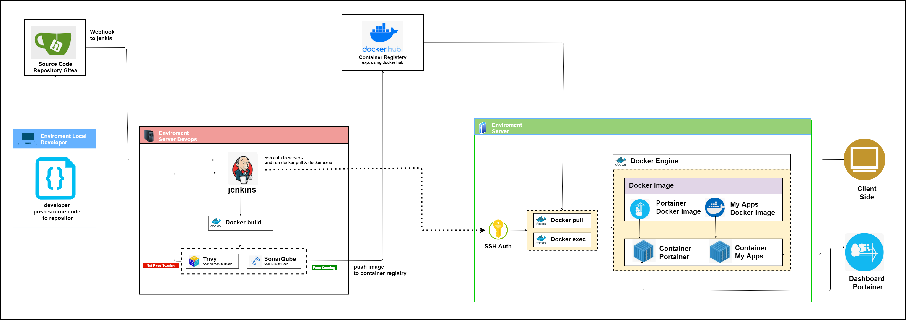

---

### 3.1 Local Developer Environment (Build Phase)

#### 3.1.1 Source Code
This folder contains the application source code.  
In this example, the application is written in **Golang** and provides two API endpoints.

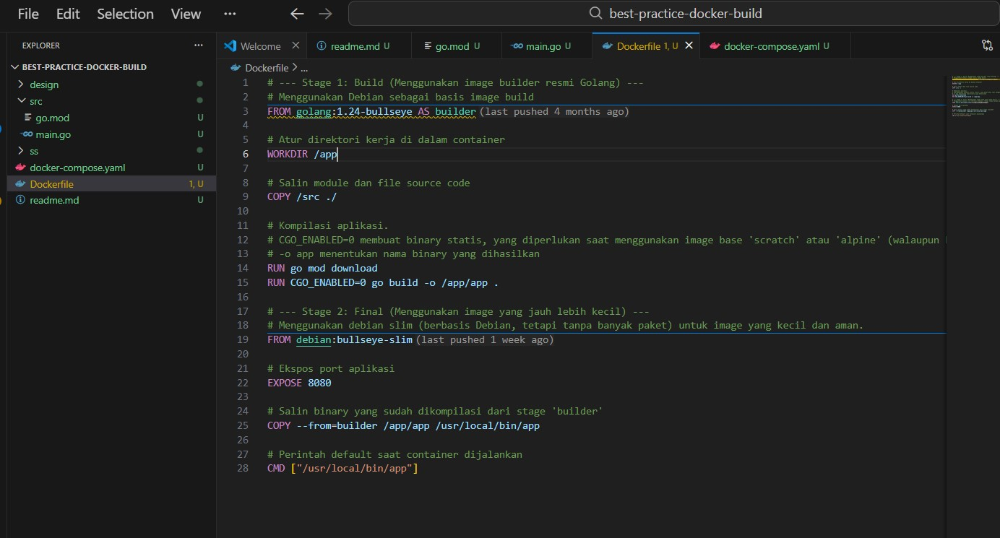


#### 3.1.2 Dockerfile
A **Dockerfile** contains instructions to build a Docker image.

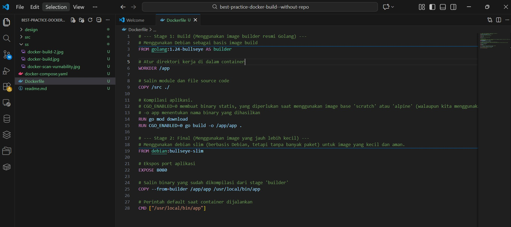

Main steps in the Dockerfile:
1. Choose a base image (example: `golang:1.24-bullseye`)
2. Copy the source code into the image
3. Compile the Go application


#### 3.1.3 Docker Build
Docker Build is the process of creating a Docker image from a Dockerfile.

Command format:
```bash
docker build -t IMAGE_NAME:VERSION PATH
```

Example:
```bash
docker build . -t my-apps:1.0
```

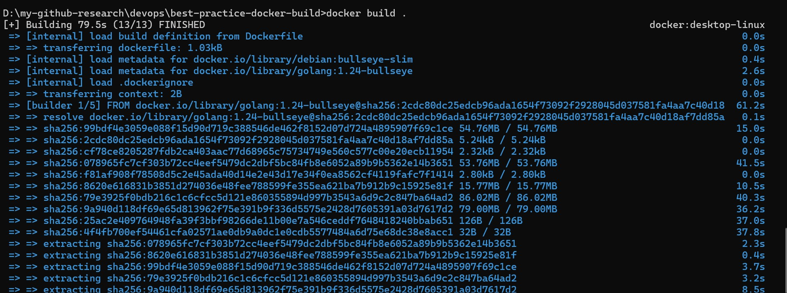
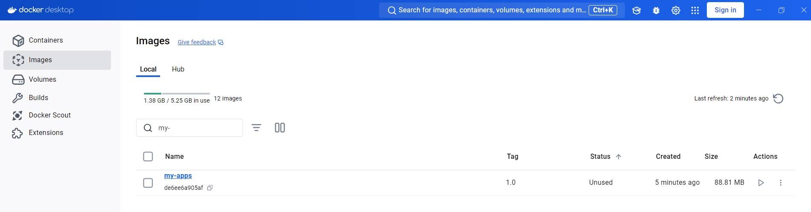


#### 3.1.4 Docker Image Vulnerability Scan
This step checks the image for known security vulnerabilities.


- **Fail (Red Path)**: Critical vulnerabilities found, build must be fixed.
- **Pass (Green Path)**: Image is safe and can continue.


#### 3.1.5 Docker Save
This step for sve image container to file *.tar and ready for bring to another server 

Docker Save is used to change an image (a ready-to-use app) into a single file (usually a .tar file). It is like putting your application into a box so you can send it to someone else.

Command format:
```bash
docker save -o nama_file.tar nama_image:tag
```

Example:
```bash
docker save -o my-apps.tar my-apps:1.0
```
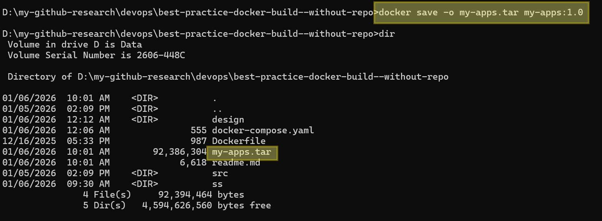

#### 3.1.6 Upload / Copy image.tar to server

After creating the image file, the next critical step is to move it to the isolated server. Depending on your environment and security rules, you can choose one of these professional methods: SCP/SSH, File Transfer Protocol (SFTP/FTP), USB/Flash Drive


### 3.2 Server Environment

#### 3.2.1 Docker Load

Command format:
```bash
docker load -i $IMAGE_FILE_TAR
```

Example:
```bash
docker load -i my-apps.tar 
```

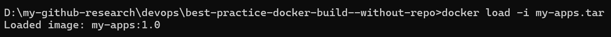

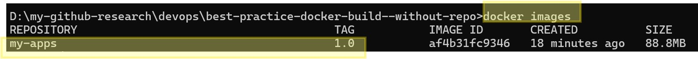


#### 3.2.2 Docker Compose
Docker Compose uses a YAML file to define which services should run, including:
- Application container

Run the services:
```bash
docker-compose up -d
```

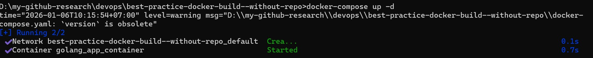


2. Create and run containers for the application and Portainer

Check container application is running

```bash
docker ps -al
```

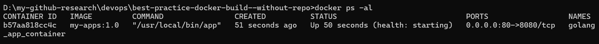


#### 3.2.2 Application Testing

The application container can be tested using Postman.

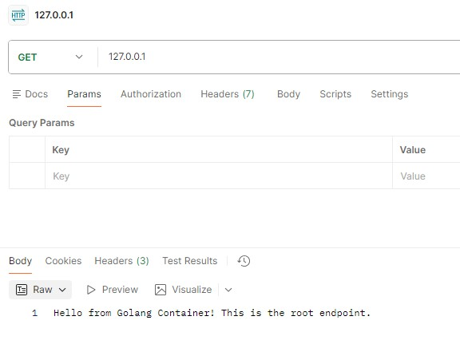

Health check endpoint test:

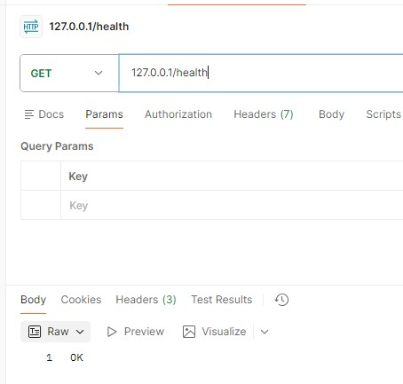
